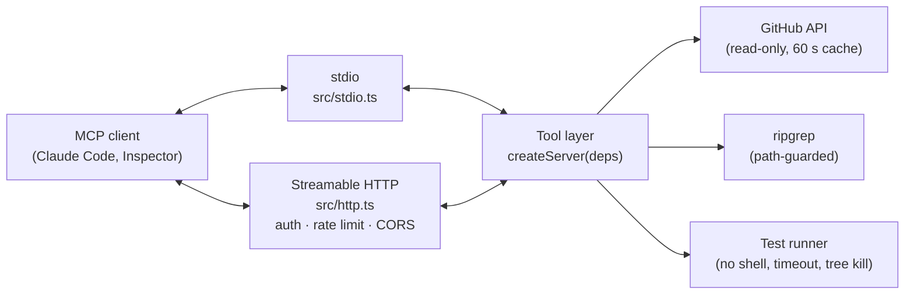

# DevPilot MCP

**Give your coding agent the issue, the code, and the failing tests in one loop.**

[](https://github.com/Ashbruh22/devpilot_mcp/actions/workflows/ci.yml)
[](https://www.npmjs.com/package/@ashbruh22/devpilot-mcp)


DevPilot is a [Model Context Protocol](https://modelcontextprotocol.io) server (TypeScript, MCP SDK v2) that gives
AI coding agents like Claude Code structured, scoped access to **GitHub issues, a codebase, its docs, and its test
suite**. It runs locally over stdio (`npx`) or remotely over Streamable HTTP.

- **Live demo:** `https://<your-app>.onrender.com` _(landing page and `/mcp` endpoint; set after deploying, see [Deployment](#deployment))_
- **Demo video:** _coming soon_

---

## Why

Most of the time an agent spends on a bug goes to _finding context_: reading the issue, guessing which files matter,
grepping, running the whole test suite, and scrolling through raw output. DevPilot collapses that into six structured,
size-capped tool calls:

```
get_issue → analyze_issue → search_codebase → run_tests → summarize_test_failures → fix
```

The server makes **no LLM calls**. Extraction is deterministic, which keeps it cheap, fast, and testable, and the
client's model already does the reasoning. See [Benchmark](#benchmark) for how the time savings are measured.

## Tools

| Tool                      | Input                                                                        | Output                                                                                                                                             |
| ------------------------- | ---------------------------------------------------------------------------- | -------------------------------------------------------------------------------------------------------------------------------------------------- |
| `get_issue`               | `owner?`, `repo?`, `issue_number`, `max_comments=20`                         | title, state, labels, author, dates, body, comments `[{author, body, created_at}]`, linked PRs, URL. Cached 60 s.                                  |
| `analyze_issue`           | `owner?`, `repo?`, `issue_number`                                            | `type_guess` (bug/feature/question/docs), `error_messages[]`, `stack_frames[]`, `mentioned_paths[]`, `code_blocks[]`, `suggested_search_queries[]` |
| `search_codebase`         | `query`, `is_regex=false`, `path_glob?`, `max_results=30`, `context_lines=2` | `matches[{path, line, preview, context_before[], context_after[]}]`, `total_matches`, `truncated`                                                  |
| `get_docs`                | `topic?`, `path?`, `max_chars=8000`                                          | `sections[{path, heading, content}]`, `available_docs[]`                                                                                           |
| `run_tests`               | `filter?`                                                                    | `run_id`, `exit_code`, `duration_ms`, `passed`, `failed`, `skipped`, `timed_out`, `output_tail`                                                    |
| `summarize_test_failures` | `run_id`                                                                     | `failures[{test_name, file, line?, message, top_frames[], likely_source_files[]}]`, `groups[]` (largest first)                                     |

Plus the **`triage_issue`** prompt (`owner`, `repo`, `issue_number`), which walks the agent through the whole loop and ends with a proposed fix.

Every tool validates its input with zod (every field is described for the model), declares an `outputSchema`, returns
structured content plus a one-line summary, truncates with an explicit `…[truncated N chars]` marker, and reports
errors as actionable tool errors (`Issue #99 not found in owner/repo`) rather than stack traces.

`owner`/`repo` are optional. Locally they default to the workspace's `origin` remote, and remotely to the only
allowlisted repo. In remote mode with several allowlisted repos, the workspace tools also take `repo: "owner/repo"`.

## Quick start

### Local (stdio)

Run it inside the repository you want the agent to work on:

```bash
claude mcp add devpilot -- npx -y @ashbruh22/devpilot-mcp
# optional, for private repos and higher rate limits:
claude mcp add devpilot -e GITHUB_TOKEN=github_pat_xxx -- npx -y @ashbruh22/devpilot-mcp
```

Then ask Claude Code to "triage issue #12", or run the prompt directly: `/mcp__devpilot__triage_issue <owner> <repo> 12`.

Any other MCP client works too:

```json
{ "mcpServers": { "devpilot": { "command": "npx", "args": ["-y", "@ashbruh22/devpilot-mcp"] } } }
```

### Remote (Streamable HTTP)

```bash
claude mcp add --transport http devpilot https://<your-app>.onrender.com/mcp
# if the server sets DEVPILOT_API_KEY:
claude mcp add --transport http devpilot https://<your-app>.onrender.com/mcp --header "Authorization: Bearer <key>"
```

The hosted server works on its allowlisted demo repo ([`demo/`](demo)), e.g. `/mcp__devpilot__triage_issue Ashbruh22 devpilot-demo 1`.

## Architecture



- **Two transports, one core.** `createServer(deps)` builds an `McpServer` with every tool registered; it knows
  nothing about transports. `stdio.ts` serves it with `serveStdio`, and `http.ts` serves it statelessly with
  `createMcpHandler` + `toNodeHandler` on Express, building one server per request. Long-lived state (GitHub cache,
  run store, workspaces) lives in `deps` and is shared.
- **Token budget by design.** Outputs are structured, every string is capped, search results shrink to fit
  `MAX_OUTPUT_CHARS`, test output keeps only the tail, and failures are grouped by normalized error message
  (numbers, strings, and paths become placeholders), so 40 failures with one root cause read as one group.
- **`likely_source_files`** are the non-test project files in each failure's stack. When the stack only reaches the
  test file (typical for assertion failures), DevPilot falls back to naming: `src/pricing.test.ts` → `src/pricing.ts`.

```
src/
├─ server.ts          createServer(deps) + createDeps(config)
├─ stdio.ts           local entry (bin)
├─ http.ts            remote entry: Express, Streamable HTTP, landing page, /healthz
├─ config.ts          env parsing with zod, fail-fast
├─ tools/             one file per tool
├─ prompts/           triage_issue
├─ lib/               github, workspace, pathGuard, exec, runStore, truncate, search, docs, failures, …
│  └─ parsers/        vitest/jest JSON, pytest JUnit XML, raw output, stack traces (JS + Python)
└─ public/index.html  landing page
```

## Security model

Running tests on a public server is remote code execution by design, so remote mode is locked down:

1. **Allowlist only.** Tools accept only repos in `ALLOWED_REPOS`. At boot, each is shallow-cloned
   (`git clone --depth 1 --branch <ref>`) into `/tmp/workspaces/<owner>__<repo>`, and its dependencies are installed
   once with `npm ci --ignore-scripts`.
2. **Fixed commands.** Test commands come from `TEST_COMMANDS`, never from tool input. `filter` must match
   `^[\w\-./ ]{1,100}$`, can't start with `-` (so it can't inject flags), and can't contain `..`. Commands run
   **without a shell**, and configured commands may not contain shell operators.
3. **Resource limits.** Each run has a `TEST_TIMEOUT_MS` timeout that kills the whole process group, output is capped,
   and each repo allows at most one concurrent test run ("busy, retry in N s"). `/mcp` is rate-limited per IP
   (60/min by default) and request bodies are capped at 1 MB.
4. **Least privilege.** The container runs as the non-root `node` user with `tini` as PID 1. The GitHub token should
   be a fine-grained, read-only PAT for public repos. `GITHUB_TOKEN`, `DEVPILOT_API_KEY`, and anything that looks like
   a secret (`*TOKEN*`, `*SECRET*`, `*PASSWORD*`, `*API_KEY*`, …) are stripped from child-process environments.
5. **Path guard.** Every client-supplied path is resolved with `path.resolve`, must stay under the workspace root, and
   is re-checked with `realpath` so symlinks can't escape. Absolute paths, `..`, and NUL bytes are rejected. Search
   results go through the same check.
6. **No arbitrary network fetches.** No tool fetches a URL from its input. GitHub is the only outbound API, and clone
   URLs are built from the allowlist.

The HTTP server also uses the SDK's Host-header validation (DNS-rebinding protection) and Origin validation on
localhost binds, an optional constant-time bearer-token check on `/mcp` (`DEVPILOT_API_KEY`), and CORS that exposes
only the MCP headers. Without a key, the server runs as a public read-only demo limited to the allowlist.

## Configuration

All configuration comes from environment variables, validated at startup. See [`.env.example`](.env.example).

| Var                               | Mode   | Default                    | Purpose                                                                  |
| --------------------------------- | ------ | -------------------------- | ------------------------------------------------------------------------ |
| `DEVPILOT_MODE`                   | both   | `local`                    | `local` or `remote`                                                      |
| `GITHUB_TOKEN`                    | both   | –                          | Fine-grained PAT. Read-only, public repos only for the hosted deployment |
| `WORKSPACE_ROOT`                  | local  | `cwd`                      | Repo to operate on                                                       |
| `TEST_COMMAND`                    | local  | auto-detect                | Override the detected test command                                       |
| `ALLOWED_REPOS`                   | remote | – (required)               | `owner/repo@ref,…`                                                       |
| `TEST_COMMANDS`                   | remote | `{}`                       | JSON `{"owner/repo": "command"}`                                         |
| `DEVPILOT_API_KEY`                | remote | –                          | Bearer token for `/mcp`. Unset means a public demo                       |
| `PORT` / `HOST`                   | remote | `3000` / `0.0.0.0`         | Listen address (`127.0.0.1` in local mode)                               |
| `ALLOWED_HOSTS`                   | remote | Render hostname            | Host-header allowlist for public binds                                   |
| `RATE_LIMIT_PER_MIN`              | remote | `60`                       | Per-IP limit on `/mcp`                                                   |
| `TEST_TIMEOUT_MS`                 | both   | `120000`                   | Test run timeout                                                         |
| `MAX_OUTPUT_CHARS`                | both   | `20000`                    | Cap on any tool's text response                                          |
| `WORKSPACES_DIR` / `INSTALL_DEPS` | remote | `/tmp/workspaces` / `true` | Where to clone, and whether to install deps                              |

Test runner auto-detection (local mode) prefers machine-readable output:
`vitest` → `vitest run --reporter=json`, `jest` → `jest --json`, `pytest` → `pytest --junitxml=… -q`, otherwise
`npm test` with best-effort text parsing. Binaries are resolved from `node_modules/.bin` (walking up for monorepos)
or run with `npx --no`, so nothing is ever downloaded.

## Development

```bash
npm install
npm run typecheck && npm run lint && npm test   # unit + integration tests
npm run build                                   # tsc → dist/, keeps the shebang, chmod +x
npm run dev:stdio                               # run from source over stdio
npm run dev:http                                # run from source over HTTP on :3000
npm run inspector                               # MCP Inspector against dist/stdio.js
npx @modelcontextprotocol/inspector             # then connect to http://localhost:3000/mcp
```

The tests cover:

- **Unit:** path guard (traversal, absolute paths, symlink escape), parsers (vitest/jest JSON, pytest JUnit XML,
  raw output), stack traces (Node, browser, Python), issue analysis, truncation, exec (tree kill on timeout, secret
  stripping, no shell), config validation.
- **Integration:** a real MCP client (`@modelcontextprotocol/client`) over in-memory and Streamable HTTP transports.
  It calls every tool against [`test/fixtures/sample-repo`](test/fixtures/sample-repo) (real vitest runs with real
  failures) with GitHub mocked by `nock`. HTTP tests cover `/healthz`, 401 without a token, 429 rate limiting, CORS,
  Host/Origin validation, and body limits. Remote-mode tests clone from a local bare git repo and check allowlist
  enforcement and fixed commands.

## Deployment

**Docker → Render.** The repo includes a multi-stage [`Dockerfile`](Dockerfile) (non-root, `tini`, git) and a
[`render.yaml`](render.yaml) blueprint:

1. Publish the demo repo: `demo/publish.sh Ashbruh22 devpilot-demo` (needs `gh`).
2. In Render, go to **New → Blueprint**, pick this repo, and set `GITHUB_TOKEN` (fine-grained, read-only, public
   repos). Optionally set `DEVPILOT_API_KEY`.
3. The health check path is `/healthz`. Render's hostname is added to the Host allowlist automatically.
4. Free instances sleep when idle: the first request can take 30–60 s. To keep it warm, set the repository variable
   `DEVPILOT_URL`, which enables the [`keepalive`](.github/workflows/keepalive.yml) workflow (a 10-minute ping). Check
   Render's current free-tier terms first.

**npm.** Tag a release (`git tag v1.0.0 && git push --tags`) and the [`release`](.github/workflows/release.yml)
workflow publishes with provenance (it needs an `NPM_TOKEN` secret). Or run `npm publish --access public` by hand, then
check it with `npx -y @ashbruh22/devpilot-mcp` in a clean folder.

## Benchmark

[`bench/`](bench) has a reproducible method: 10 tasks on the demo repo ("find the root cause of issue #N and the file
to change"), each timed once without DevPilot (the agent reads files and runs commands itself) and once with the
`triage_issue` flow. It records time-to-context and tool calls or steps. Results go in
[`bench/results.csv`](bench/results.csv), and `npm run bench:summary` prints the medians.

> **Status:** the harness and tasks are in place. The results table is empty until the runs are done, so no
> time-saved number is claimed yet. Quote only the measured median.

## License

MIT
